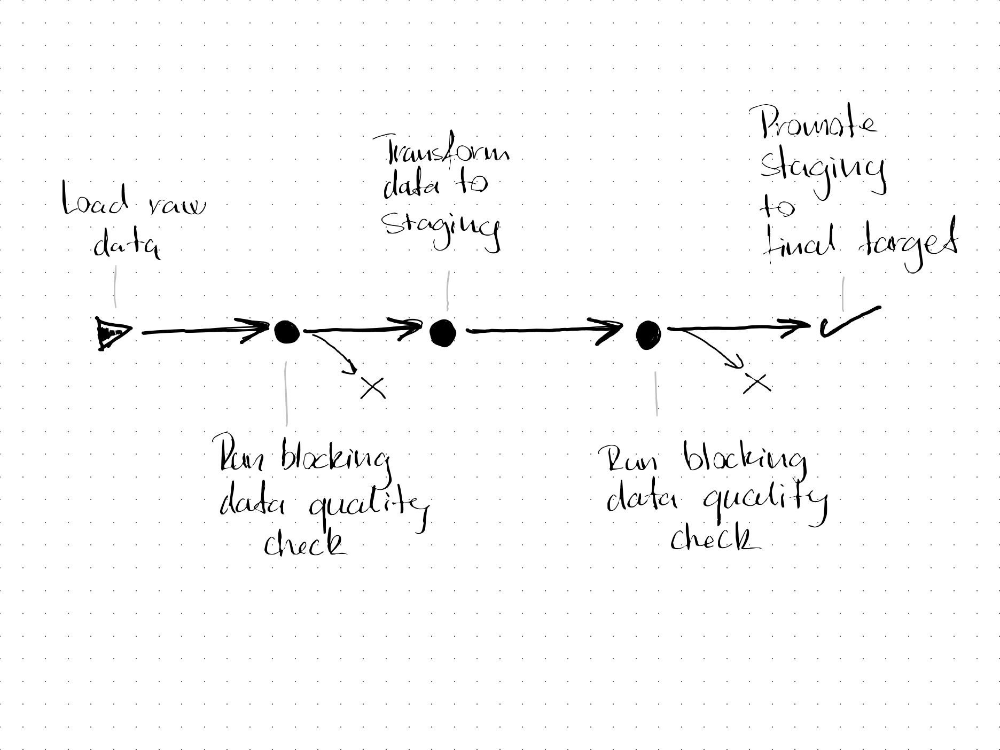
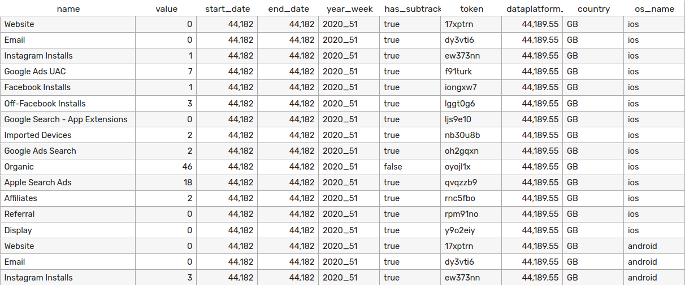
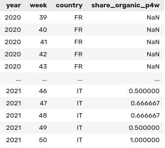
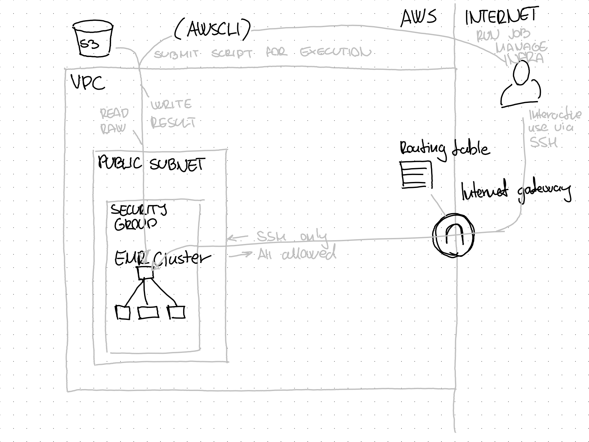

# Assignment: Platfrom Data Engineer at Yolt

- [Assignment: Platfrom Data Engineer at Yolt](#assignment-platfrom-data-engineer-at-yolt)
  - [Assignment summary](#assignment-summary)
  - [Spark application](#spark-application)
    - [Input data](#input-data)
    - [Target data](#target-data)
    - [Transformation steps](#transformation-steps)
    - [Caveats](#caveats)
    - [Data quality checks / Pipeline tests](#data-quality-checks--pipeline-tests)
  - [Infrastructure](#infrastructure)
    - [S3 bucket](#s3-bucket)
    - [EMR Cluster](#emr-cluster)
  - [Scheduling](#scheduling)
  - [Deploying infrastructure and running Spark application](#deploying-infrastructure-and-running-spark-application)

## Assignment summary

The assignment required two pieces of work:

1. Deploying a Spark application to transform the sample dataset provided
2. Deploy the infrastructure necessary to run the Spark application

## Spark application

The Spark application implements the following ELT pipeline, *except for the pipeline test steps*



I assumed a batch processing use case.

### Input data



The input data is assumed to be

- an aggregated summary of the number of new users acquired through different marketing channels
- per day
- per country
- per operating system

Some propereties to keep in mind were:

- The dataset contains redundant columns, as `token`, `name` and `has_subtrackers` are fully correlated, having a 1:1:1 mapping between their distinct values.
- The table further contains aggregated rows for `country` and `os_name`, similar to an OLAP cube.
- The date dimension is not continuous, there are *date x country* combinations with no data

### Target data

I decided to create a table showing the proportion of new users acquired via the organic channel, per week, per country, over a rolling window of past 4 weeks.



### Transformation steps

**This is a high-level walkthrough, for details see [`scripts/transform.py`](scripts/transform.py).**

1. Select subset of data

    ```python
    (df
        .filter((fn.col("os_name") == "all") & (fn.col("country") != "ALL"))
        .select(
            [
                (fn.col("name") == "Organic").alias("is_organic"),
                "value",
                "year_week",
                "country",
            ]
        )
    ```

2. Reshape and make date dimension continuous

    ```python
        .groupby(["year_week", "country"]).pivot("is_organic").sum("value")
        .join(
            other=fn.broadcast(filler),
            on=['year_week', 'country'],
            how='outer'
        )
    ```

3. Apply window functions, fill missing data with zeros

    ```python
        .withColumn("period", year_week_to_int(fn.col("year_week")))
        .fillna(0)
        .withColumn("sum_nonorganic_P4W", fn.sum("false").over(window_four_weeks))
        .withColumn("sum_organic_P4W", fn.sum("true").over(window_four_weeks))
    ```

4. Calculate proportion, select columns for presentation

    ```python
        .select(
            [
                fn.split("year_week", "_").getItem(0).cast("int").alias("year"),
                fn.split("year_week", "_").getItem(1).cast("int").alias("week"),
                "country",
                (
                       fn.col("sum_organic_P4W")
                    / (fn.col("sum_organic_P4W") + fn.col("sum_nonorganic_P4W"))
                ).alias("share_organic_p4w"),
            ]
        )
    )
    ```

### Caveats

- The rolling window is calculated on the current week and the three preceding weeks, therefore in reality it is a rolling window of 22-28 days depending on the current day of week. However this likely doesn't have a significant practical impact on the metric, while potentially allowing to move less data around when applying the window functions. This can have a positive performance impact in case of a large dataset.

### Data quality checks / Pipeline tests

For a lack of time, I haven't implemented the data quality check steps in the pipeline, however, I had the following in mind:

**1. Test between raw and staging**

- To ensure the input data doesn't violate assumptions that the transformation depends on, eg. the pattern of the `year_week`-column is always `yyyy_ww`, otherwise the last select clause would not be able to separate it into `year` and `week` columns.
- To ensure the input data doesn't violate any business logic and have no errors, eg. allowed values for channel names and countries

**2. Test between staging and final table**

- We can also test the resulting table to make sure there are no duplicate rows, missing year-month-country combinations, etc.
- We can apply statistical checks eg. to get an automated warning in case values deviate from their historical distribution. This can be useful to detect data drift for ML applications.

**For executing these tests, I would recommend using either [deequ](https://github.com/awslabs/python-deequ) or [great expectations](https://greatexpectations.io).**

## Infrastructure



### S3 bucket

- Contains input data
- Contains transformation script
- Contains bootstrap script for the EMR cluster
- EMR logs are written here
- Transformed data is written here

### EMR Cluster

- Running on EC2
- Latest versions
- Security group allows inbound SSH to allow working on the cluster interactively
- IAM policy allows read and write on S3 Bucket

## Scheduling

Due to time constraint, I haven't implemented a scheduler.  
**I would recommend to use Apache Airflow for scheduling.**

## Deploying infrastructure and running Spark application

0. *Install `terraform` and `aws` command line tools if necessary.*

1. Create and source `.env`-file

    ```bash
    mv .env.example .env
    nano .env  # fill in values
    source .env
    ```

2. Deploy the infrastructure

    ```bash
    cd terraform
    terraform apply
    ```

    Note the ID of the EMR cluster from the output of the previous command!

    ```bash
    CLUSTER_ID=  # cluster_id_from_terraform_output
    ```

3. Send the Spark application for execution  
   *`noglob` needed in zsh, leave it out for bash*

    ```bash
    noglob aws emr add-steps \
        --cluster-id $CLUSTER_ID \
        --steps\
            Type=Spark,Name="transform.py",ActionOnFailure=CONTINUE,Args=[s3://$TF_VAR_bucket_name/scripts/transform.py,--source_parquet,s3://$TF_VAR_bucket_name/data/raw/sample.snappy.parquet,--target_parquet,s3://$TF_VAR_bucket_name/data/output/output.snappy.parquet]
    ```

    Note the step id from the output of the above!

4. Optional: Check progress of Spark application

    ```bash
    STEP_ID=  # step_id_from_output_of_aws_emr_add_steps

    watch aws emr describe-step --cluster-id $CLUSTER_ID --step-id $STEP_ID
    ```

    *Press Ctrl+c to stop cheking.*

5. Cleanup

    The results are written to  
    `s3://$TF_VAR_bucket_name/data/output/output.snappy.parquet`

    Stop the cluster and clean up the environment by issuing  
    **`terraform destroy -auto-approve`**
